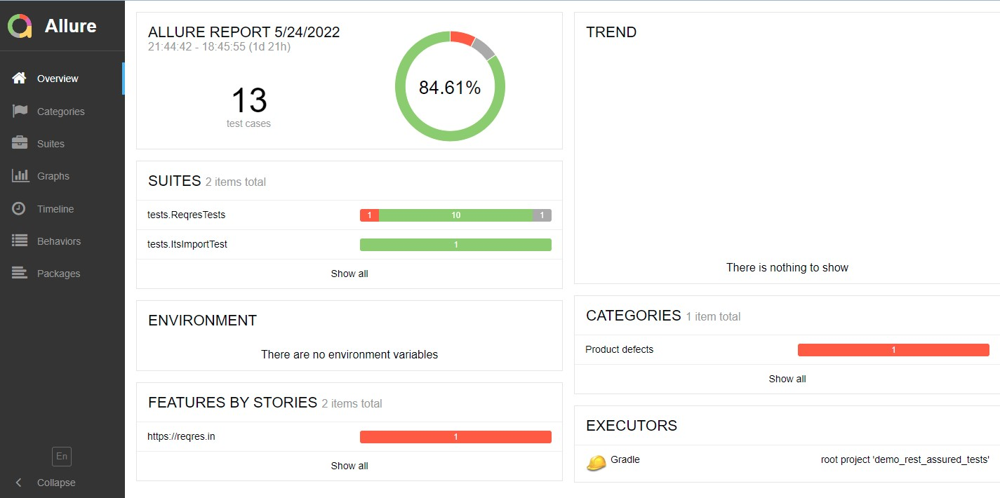
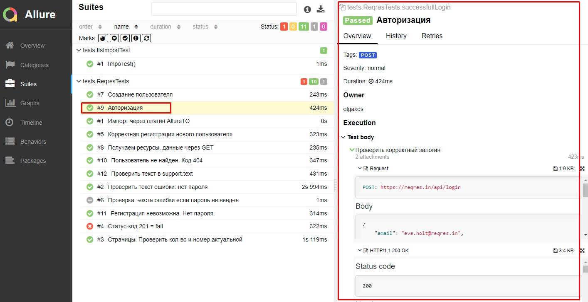

# Проект по автоматизации тестирования API (demo2)
:earth_americas: https://reqres.in

Пример API тестов из открытого источника. 
Сборка запущена с помощью инструмента удаленного запуска Jenkins
Получены результаты теста в формате Allure отчета
Добавление артефактов тестирования (скриншот и видео) для API тестов не предусмотерно.

## Содержание:
- [Технологии и инструменты](#watermelon-технологии-и-инструменты)
- [Реализованные проверки](#watermelon-Реализованные-проверки)
- [Запуск из терминала](#watermelon-Запуск-тестов-из-терминала)
- [Отчет о прохождении тестов в Allure report](#bellhop_bell-Отчет-о-прохождении-тестов-в-Allure-report)
<!--
- [Запуск тестов в Jenkins](#watermelon-Запуск-тестов-в-Jenkins)
- [Тестовая документация в Allure TestOps](#watermelon-Тестовая-документация-в-Allure-TestOps)
- [Отчет в Telegram](#bellhop_bell-Отчет-в-Telegram)
-->

## :watermelon: Технологии и инструменты
<p align="center">
<a href="https://www.jetbrains.com/idea/"></a>  
<a href="https://www.java.com/"></a>
<a href="https://gradle.org/"></a>
<a href="https://qameta.io/"></a>
<!-- <a href="https://selenide.org/"></a> -->
<a href="https://rest-assured.io/"></a>
<!--<a href="https://www.jenkins.io/"></a>
<a href="https://github.com/allure-framework/allure2"></a>  
<a href="https://qameta.io/"></a>
<a href="https://habr.com/ru/post/438870/"></a>  
<a href="https://aerokube.com/selenoid/"></a>
<a href="https://web.telegram.org/"></a>
-->
</p>

Перечень технологий и инструментов, использованных при реализации этого проекта:
- Автотесты написаны на языке `Java`
- Для сборки проекта используется `Gradle`
- Java-библиотека для автоматизации тестирования REST-API: `REST Assured`
- Проект `Lombok`- плагин компилятора, который добавляет в Java новые «ключевые слова» и превращает аннотации в Java-код.
- 

## :watermelon: Реализованные проверки
Примеры API тестов:
- [✓] Cоздание пользователя
- [✓] Авторизация
- [✓] Проверить текст ошибки: нет пароля
- [✓] Корректная регистрация нового пользователя
- [✓] Регистрация невозможна. Нет пароля.
- [✓] Пример пропущенного теста.
- [✓] Пример упавшего теста (negativeLoginNegative)

## :watermelon: Запуск тестов из терминала
Шаги:
1. Открыть терминал
2. Запустить на выполнение команду:
###### Локальный запуск:
```
gradle clean test
```

## :watermelon: Запуск тестов в Jenkins
Ссылка

## :bellhop_bell: Отчет о прохождении тестов в Allure report
После того как тесты завершились, можно получить визуальный Allure отчет:

###### Главный экран отчета (Owerwiev)
<p align="center">

</p>

###### Страница с проведенными тестами (Suites)
<p align="center">

</p>

<!--
## :watermelon: Тестовая документация в Allure TestOps

<p align="center">
  
</p>

Обзор тестовых запусков:
<p align="center">
  
</p>

## :bellhop_bell: Отчет в Telegram
После завершения сборки специальный Telegram-бот отправляет сообщение с отчетом о прогоне тестов.
Чтобы видеть сообщения от бота, вступите (временно) в телеграм-группу `OlgaKos Bot_Group`

<p align="center">

</p>
-->
----------
2022-05-24 Что надо доделать: Дженкинс + Телеграм
